# Diagrama UML - Arquitectura API IndieQuest

## Diagrama de Clases - Arquitectura de Capas

```mermaid
classDiagram
    %% Controllers Layer
    class PostController {
        -IMediator mediator
        +CreatePost(command) Post
        +GetAllPosts() List~Post~
        +GetPostById(id) Post
        +GetPostsByUserId(userId) List~Post~
        +UpdatePost(command) Post
        +DeletePost(id) void
    }

    class UserController {
        -IMediator mediator
        +CreateUser(command) User
        +GetAllUsers() List~User~
        +GetUserById(id) User
        +UpdateUser(command) User
        +DeleteUser(id) void
    }

    %% Application Layer - Commands
    class CreatePostCommand {
        -string Title
        -string Description
        -string MediaContent
        -int UserId
    }

    class CreatePostCommandHandler {
        -IPostRepository repository
        +Handle(command) Post
    }

    class UpdatePostCommand {
        -int PostId
        -string Title
        -string Description
        -string MediaContent
    }

    class UpdatePostCommandHandler {
        -IPostRepository repository
        +Handle(command) Post
    }

    class DeletePostCommand {
        -int PostId
    }

    class DeletePostCommandHandler {
        -IPostRepository repository
        +Handle(command) void
    }

    %% Application Layer - Queries
    class GetAllPostsQuery {
    }

    class GetAllPostsQueryHandler {
        -IPostRepository repository
        +Handle(query) List~Post~
    }

    class GetPostByIdQuery {
        -int PostId
    }

    class GetPostByIdQueryHandler {
        -IPostRepository repository
        +Handle(query) Post
    }

    class GetPostsByUserIdQuery {
        -int UserId
    }

    class GetPostsByUserIdQueryHandler {
        -IPostRepository repository
        +Handle(query) List~Post~
    }

    %% User Commands
    class CreateUserCommand {
        -string Username
        -string Email
        -string Password
        -string UserBio
    }

    class CreateUserCommandHandler {
        -IUserRepository repository
        +Handle(command) User
    }

    class UpdateUserCommand {
        -int UserId
        -string Username
        -string Email
        -string UserBio
        -bool AvailableForWork
    }

    class UpdateUserCommandHandler {
        -IUserRepository repository
        +Handle(command) User
    }

    class DeleteUserCommand {
        -int UserId
    }

    class DeleteUserCommandHandler {
        -IUserRepository repository
        +Handle(command) void
    }

    %% User Queries
    class GetAllUsersQuery {
    }

    class GetAllUsersQueryHandler {
        -IUserRepository repository
        +Handle(query) List~User~
    }

    class GetUserByIdQuery {
        -int UserId
    }

    class GetUserByIdQueryHandler {
        -IUserRepository repository
        +Handle(query) User
    }

    %% Domain Layer
    class User {
        -int UserId
        -string Username
        -string Email
        -string Password
        -string UserBio
        -string UserProfilePicture
        -bool AvailableForWork
        -DateTime dateOfRegistration
    }

    class Post {
        -int PostId
        -string Title
        -string MediaContent
        -string Description
        -DateTime CreationDate
    }

    class Tag {
        -int tagId
        -string tagName
    }

    %% Repository Interfaces
    class IPostRepository {
        +Create(post) Post
        +GetById(id) Post
        +GetAll() List~Post~
        +GetByUserId(userId) List~Post~
        +Update(post) Post
        +Delete(id) void
    }

    class IUserRepository {
        +Create(user) User
        +GetById(id) User
        +GetAll() List~User~
        +Update(user) User
        +Delete(id) void
    }

    %% Infrastructure Layer
    class PostgreSqlPostRepository {
        -IndieQuestDbContext context
        +Create(post) Post
        +GetById(id) Post
        +GetAll() List~Post~
        +GetByUserId(userId) List~Post~
        +Update(post) Post
        +Delete(id) void
    }

    class PostgreSqlUserRepository {
        -IndieQuestDbContext context
        +Create(user) User
        +GetById(id) User
        +GetAll() List~User~
        +Update(user) User
        +Delete(id) void
    }

    class IndieQuestDbContext {
        -DbSet~User~ Users
        -DbSet~Post~ Posts
        -DbSet~Tag~ Tags
        +SaveChanges() void
    }

    %% Relationships
    PostController --> CreatePostCommand
    PostController --> UpdatePostCommand
    PostController --> DeletePostCommand
    PostController --> GetAllPostsQuery
    PostController --> GetPostByIdQuery
    PostController --> GetPostsByUserIdQuery

    UserController --> CreateUserCommand
    UserController --> UpdateUserCommand
    UserController --> DeleteUserCommand
    UserController --> GetAllUsersQuery
    UserController --> GetUserByIdQuery

    CreatePostCommandHandler --> CreatePostCommand
    CreatePostCommandHandler --> IPostRepository

    UpdatePostCommandHandler --> UpdatePostCommand
    UpdatePostCommandHandler --> IPostRepository

    DeletePostCommandHandler --> DeletePostCommand
    DeletePostCommandHandler --> IPostRepository

    GetAllPostsQueryHandler --> GetAllPostsQuery
    GetAllPostsQueryHandler --> IPostRepository

    GetPostByIdQueryHandler --> GetPostByIdQuery
    GetPostByIdQueryHandler --> IPostRepository

    GetPostsByUserIdQueryHandler --> GetPostsByUserIdQuery
    GetPostsByUserIdQueryHandler --> IPostRepository

    CreateUserCommandHandler --> CreateUserCommand
    CreateUserCommandHandler --> IUserRepository

    UpdateUserCommandHandler --> UpdateUserCommand
    UpdateUserCommandHandler --> IUserRepository

    DeleteUserCommandHandler --> DeleteUserCommand
    DeleteUserCommandHandler --> IUserRepository

    GetAllUsersQueryHandler --> GetAllUsersQuery
    GetAllUsersQueryHandler --> IUserRepository

    GetUserByIdQueryHandler --> GetUserByIdQuery
    GetUserByIdQueryHandler --> IUserRepository

    IPostRepository <|.. PostgreSqlPostRepository
    IUserRepository <|.. PostgreSqlUserRepository

    PostgreSqlPostRepository --> IndieQuestDbContext
    PostgreSqlUserRepository --> IndieQuestDbContext

    IndieQuestDbContext --> User
    IndieQuestDbContext --> Post
    IndieQuestDbContext --> Tag
```

## Patrones Utilizados

- **CQRS**: Separación entre Commands (escritura) y Queries (lectura)
- **Repository Pattern**: Abstracción del acceso a datos
- **Dependency Injection**: Inyección de dependencias a través de Mediator
- **Entity Framework**: ORM para acceso a base de datos
